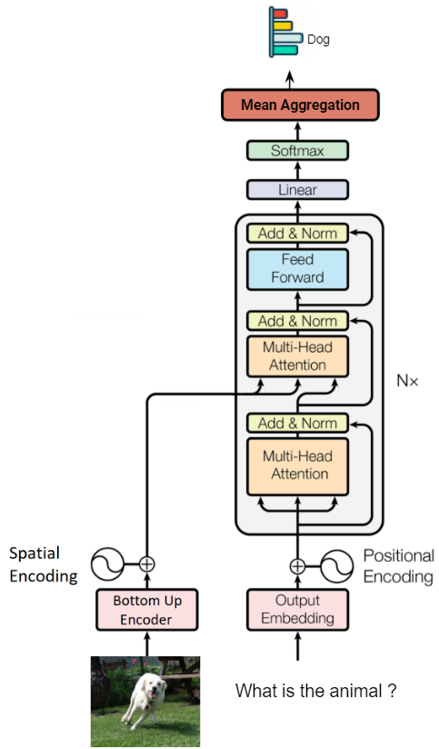

# Visual Question Answering with Transformer
This project applies Transformer-based model for Visual Question Answering task. In this study project, most of the work are reimplemented, some are adapted with lots of modification. The purpose of this project is to test the performance of the Transformer architecture and Bottom-Up feature.

Notebook: [](https://colab.research.google.com/drive/1_batc7Kmvi0LmaM5EXE-9RkstOP57Q2x?usp=sharing)

The following figure gives an overview of the baseline model architectures.

<div align="center"></div>

- In the visual encoding stage which uses [bottom-up attention](https://arxiv.org/abs/1707.07998), FasterRCNN is used to extract features for each detected object in the image. This method captures visual meanings with object-aware semantics.

| Bottom-Up Encoder |
|:-------------------------:|
| |

- Answer vocabulary is built based on the all the answers in the train+val set.
- To extract bottom-up features, I provide [Colab Notebook](https://colab.research.google.com/drive/1xC4mVc_bp0t4-7T4xVum3AECFCalsgsv?usp=sharing) which adapts code from [Detectron model](https://github.com/airsplay/py-bottom-up-attention)


## Datasets
I train both the bottom-up models on small subset of COCO2014 dataset, [Toronto COCO-QA](http://www.cs.toronto.edu/~mren/research/imageqa/data/cocoqa/),  which contains 123,287 images, with 78,736 train questions and 38,948 test questions. All answers in this subset are one-word. 

For VQA data format, see [VQA format](https://visualqa.org/vqa_v1_download.html)

## Evaluation Method
I use the evaluation metric which is robust to inter-human variability in phrasing the answers:

<div align="center"></div>

Before evaluating machine generated answers, the code do the following processing:
- Making all characters lowercase
- Removing periods except if it occurs as decimal
- Converting number words to digits
- Removing articles (a, an, the)
- Adding apostrophe if a contraction is missing it (e.g., convert "dont" to "don't")
- Replacing all punctuation (except apostrophe and colon) with a space character. We do not remove apostrophe because it can incorrectly change possessives to plural, e.g., “girl’s” to “girls” and colons because they often refer to time, e.g., 2:50 pm. In case of comma, no space is inserted if it occurs between digits, e.g., convert 100,978 to 100978. (This processing step is done for ground truth answers as well.)

## Results
| Images | Question-Answer Pairing |
|:-------------------------:|:-------------------------:|
|  | **Question**: what is on the sofa ? <br> **Answer**: cat (0.693) <br> <br> **Question**: what is the cat lying on ? <br> **Answer**: couch (0.097) <br> <br> **Question**: what color is the cat ? <br> **Answer**: orange (0.831) <br> <br> **Question**: how many cat are there on the sofa ? <br> **Answer**: two (0.584) |
|  |  **Question**: what are the people riding on ? <br> **Answer**: horses (0.633) <br> <br> **Question**: how many people are there ? <br> **Answer**: three (0.308) |
|  | **Question**: what is the woman carrying ? <br> **Answer**: umbrella (0.867) <br> <br> **Question**: what is color of the dress the woman wearing ? <br> **Answer**: white (0.589) |
|  |  **Question**: what are the people in the background doing ? <br> **Answer**: kites (0.426) <br> <br> **Question**: what is the kid wearing on the head ? <br> **Answer**: hat (0.239) <br> <br> **Question**: what is the color of the tent ? <br> **Answer**: green (0.326) <br> <br> **Question**: what is the color of the hat ? <br> **Answer**: blue (0.197) |
|  |  **Question**: what is the woman doing ? <br> **Answer**: surfboard (0.358) <br> <br> **Question**: what is color of the outfit of the woman ? <br> **Answer**: green (0.529) |

## Usage
- To train patch-based / bottom-up architecture:
``` 
python train.py (--bottom-up)
```

- To evalualte trained model:
``` 
python evaluate.py --weight=<checkpoint path> (--bottom-up)
```

## Paper References

- [VQA: Visual Question Answering](https://arxiv.org/abs/1505.00468) (2015; Aishwarya Agrawal et al.)
- [Bottom-Up and Top-Down Attention for Image Captioning](https://arxiv.org/abs/1707.07998) (2018; Peter Anderson et. al)

## Code References
- https://github.com/rwightman/pytorch-image-models/blob/master/timm/models/vision_transformer.py
- https://github.com/SamLynnEvans/Transformer
- https://nlp.seas.harvard.edu/2018/04/03/attention.html
- https://huggingface.co/blog/how-to-generate
- https://github.com/airsplay/py-bottom-up-attention
